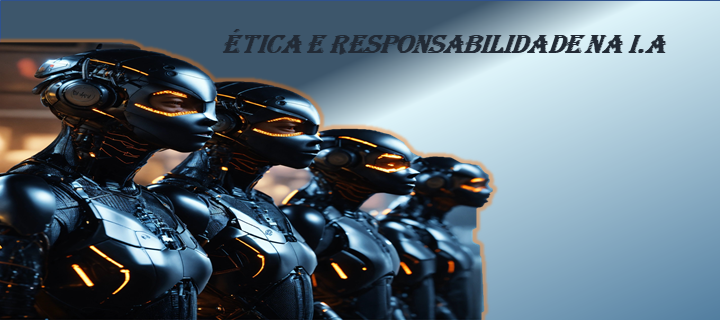

# Ética e Responsabilidade na Inteligência Artificial: Um Guia Simples!

  

## Introdução

E aí, galera nerd! 🤓 A inteligência artificial (IA) tá bombando, né? Mas, ó, com grandes poderes vêm grandes responsabilidades! Nesse artigo,
 vamos falar sobre as paradas éticas da IA e como a gente pode usar ela de boa.

## O que é Inteligência Artificial?

Pensa na IA como se fosse o Jarvis do Homem de Ferro, só que em vez de ajudar o Tony Stark, ela está em todo lugar: no seu celular, no seu videogame,
 até na sua geladeira! A inteligência artificial é quando a gente ensina as máquinas a pensar e aprender sozinhas. Legal, né?

 ## Por que a Ética é Importante na IA?

Imagina se o Jarvis só ajudasse o Tony Stark e ignorasse todo mundo? Seria injusto! A ética na IA garante que essas super máquinas façam coisas justas
 e legais pra todo mundo. É tipo garantir que todos os heróis tenham suas chances, não só os Vingadores.

 ## Viés Algorítmico

 Viés é como quando um juiz de eSports sempre favorece o mesmo time. Na IA, isso acontece quando as máquinas aprendem de forma injusta e
  tomam decisões baseadas nisso. Precisamos treinar nossas IAs para serem mais justas do que o Batman no papel do herói solitário.

 ## Tomada de Decisão Automatizada

Quando deixamos a IA decidir sozinha, tipo um robô decidindo quando o sinal deve ficar verde ou vermelho,aprovar empréstimos ou
 escolher quem vai ser contratado. Mas, ó, essas decisões automáticas podem ser injustas ou preconceituosas. Tem que ser transparente
 chamamos isso de tomada de decisão automatizada. É bacana, mas precisamos garantir que essas decisões não sejam como deixar o Loki no comando do tráfego.

## Privacidade dos Dados

 A IA precisa de dados pra aprender, mas isso também significa que nossas infos tão sendo coletadas. Tem que proteger nossa privacidade!
  Regras e regulamentos tão aí pra isso. Tipo o GDPR na Europa, que é tipo o escudo do Capitão América pros nossos dados.

##  Políticas Regulatórias
  
  Imagina as regras do torneio de eSports mais épico. As políticas regulatórias são as regras que dizem o que a IA pode ou não pode fazer.
  Elas ajudam a manter tudo justo, como um juiz super imparcial no campeonato mundial de LoL.

##  Transparência e Explicabilidade dos Algoritmos

Transparência é como abrir a Batcaverna pra ver todos os gadgets do Batman. Queremos saber como a IA toma decisões,
como se pudéssemos olhar dentro do cérebro do Ultron (sem o perigo de ser atacado, claro).
Explicabilidade é quando alguém nos explica essas decisões de um jeito que até um padawan entende.

## Impacto na Sociedade

A IA pode ser tão revolucionária quanto descobrir que você tem superpoderes. Ela pode facilitar nossa vida, tipo ter um mordomo robô,
mas também pode trazer problemas se não for usada direito. Precisamos pensar em como a IA afeta todo mundo, imagina só: automação de empregos,
galera ficando sem trampo. A gente tem que pensar no impacto social e correr atrás de soluções pra não zoar tudo.

### Exemplos Práticos: Bora Lá!

Reconhecimento Facial: Tipo o Jarvis identificando vilões. Pode ajudar a encontrar pessoas desaparecidas,
mas também pode ser usado pra vigiar você sem permissão. Meio stalker, né?
Assistentes Virtuais: Como a Alexa ou o Google Assistant, que são tipo seus ajudantes pessoais. Eles ajudam em tarefas diárias,
mas também ficam de ouvido em pé, o que pode ser meio invasivo.

### Bora Debater!?

Curtiu? Então vamos continuar essa conversa! Segue minhas redes sociais https://img.shields.io/badge/GitHub-100000?style=for-the-badge&logo=github&logoColor=white   https://img.shields.io/badge/LinkedIn-0077B5?style=for-the-badge&logo=linkedin&logoColor=white   https://img.shields.io/badge/Instagram-E4405F?style=for-the-badge&logo=instagram&logoColor=white
 pra gente discutir mais sobre como a tecnologia tá mudando nosso mundo
e como a gente pode usar tudo isso de um jeito super responsável e justo.
Compartilha esse artigo, chama a galera pra debater!

Fontes de produção

Ilustraões de capa e arts: Geradas pela lexica.art e Microsoft Copilot
Conteudo gerado por: ChatGPT e revisado por humano e Microsoft Copilot
